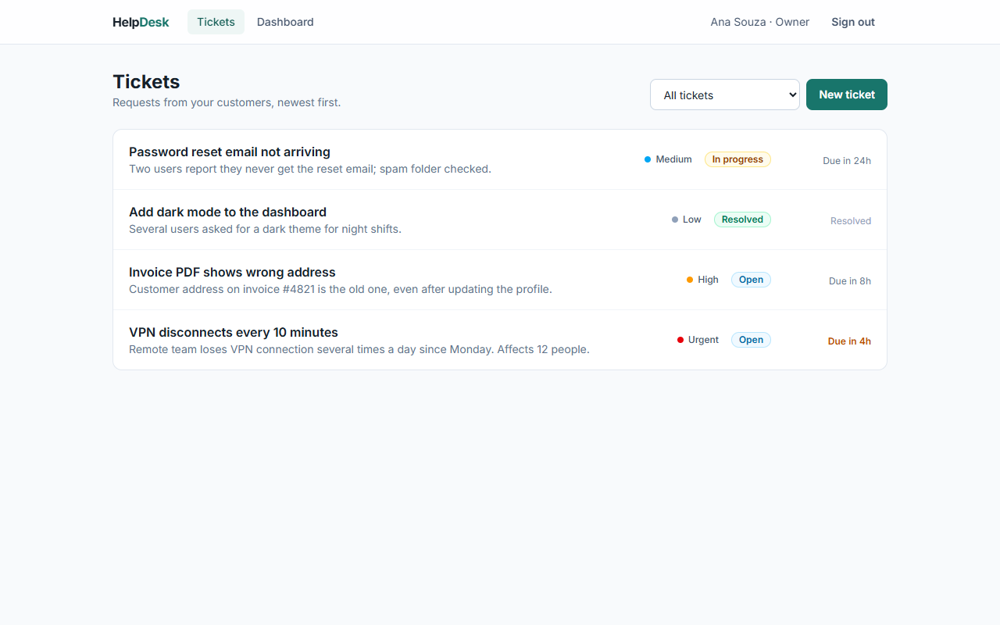
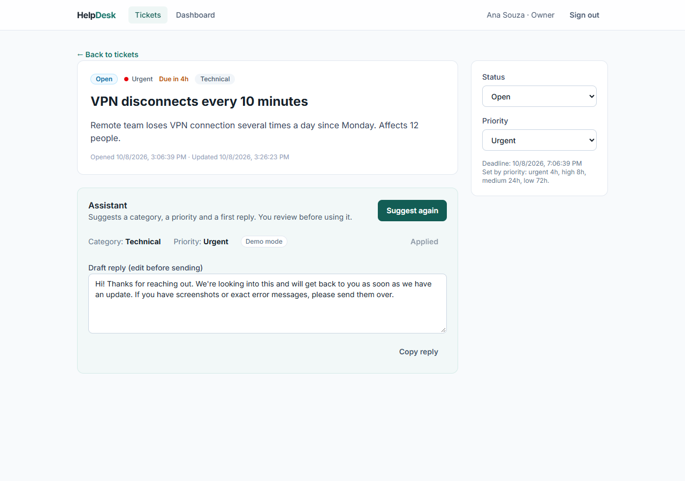
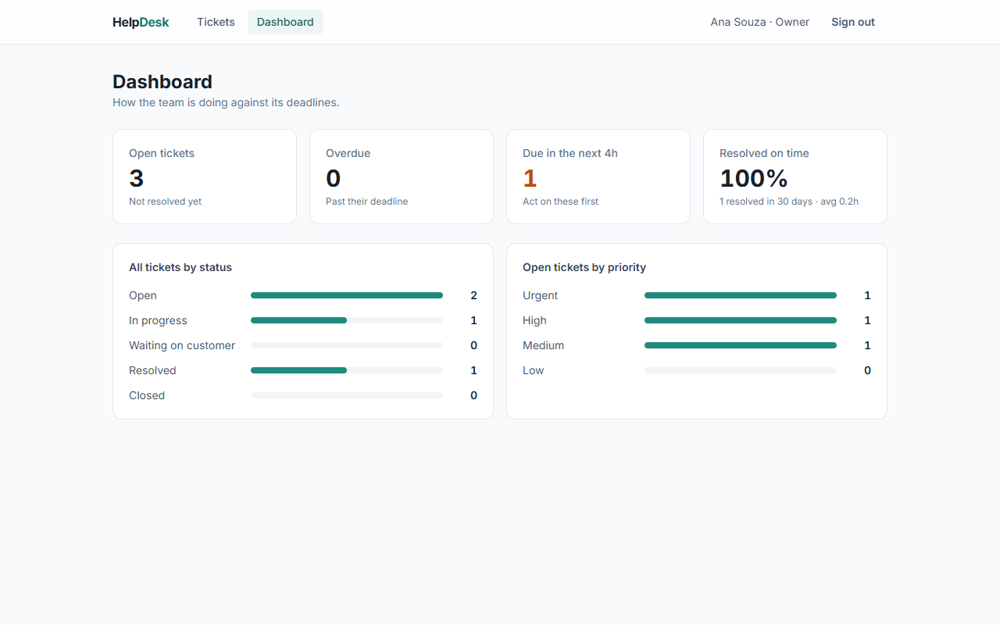

# HelpDesk

[](https://github.com/fontanella01/helpdesk/actions/workflows/ci.yml)

A multi-tenant support ticket system with SLA tracking and an AI triage assistant.
Each company gets its own workspace, its team opens and resolves tickets against deadlines,
and an assistant suggests category, priority and a first reply for every ticket.

**Stack:** React · TypeScript · Vite · Tailwind CSS · Node.js · Fastify · PostgreSQL · Drizzle ORM · Zod · Vitest · Claude API



| AI assistant | Dashboard |
|---|---|
|  |  |

## Features

- **Workspaces (multi-tenant):** sign up creates a company and its owner; the owner adds agents. Every query is scoped to the user's organization.
- **Tickets:** create, filter by status, change status and priority.
- **SLA:** each priority has a deadline (urgent 4h, high 8h, medium 24h, low 72h). Overdue and due-soon tickets stand out; the clock stops when a ticket is resolved and restarts if it is reopened.
- **Dashboard:** open, overdue and due-soon counts, on-time resolution rate and average resolution time over 30 days.
- **AI triage:** suggests category, priority and a draft reply. The agent reviews and applies; nothing is changed or sent automatically. Works without an API key in a rule-based demo mode.
- **Responsive:** usable on phones.

## Architecture

```
apps/
  web/   React + Vite. Talks to the API through /api (Vite proxy in development).
  api/   Fastify + Drizzle ORM.
    src/routes/     HTTP routes (auth, tickets, dashboard)
    src/domain/     pure business rules (SLA), no I/O
    src/ai/         suggestion providers: Claude or demo, behind one interface
    src/db/         schema, SQL migrations and the database client
    test/           integration and unit tests
```

PostgreSQL runs as **PGlite** (Postgres compiled to WebAssembly) in development and tests, so there is nothing to install.
In production the same code connects to any PostgreSQL through `DATABASE_URL`.

## Design decisions

- **Tenant isolation comes from the token, never from the request.** The organization is read from the signed JWT, so a client cannot read or write another company's data by changing an id or a header. Another tenant's ticket answers 404, not 403, so its existence is not revealed. Tests cover these cases.
- **Validation in two layers.** Zod rejects bad input at the edge; `CHECK` constraints in the database guarantee that even a bug cannot store an invalid status, priority or category.
- **Passwords:** salted scrypt hashes and constant-time comparison. Login gives the same answer and takes about the same time for an unknown email and a wrong password.
- **Business rules as pure functions.** SLA rules have no database or clock inside. The clock is injected, so tests move time forward instead of waiting.
- **Aggregation in SQL.** The dashboard uses `count(*) FILTER (...)` and `avg(...)` in PostgreSQL instead of loading tickets into Node.
- **AI behind an interface.** Routes depend on a `Suggester`; the Claude implementation uses structured output validated by Zod, so the model cannot return a category outside the list. Ticket text is treated as untrusted data in the prompt, and a refusal or unparseable answer falls back to the rule-based suggestion. Tests never call the real API.

## Running locally

Requires Node.js 22+.

```bash
npm install
cp apps/api/.env.example apps/api/.env   # set JWT_SECRET; ANTHROPIC_API_KEY is optional
npm run dev:api    # http://localhost:3333
npm run dev:web    # http://localhost:5173
```

Open http://localhost:5173 and create a workspace.

## Tests

```bash
npm test          # 29 tests: auth, tenant isolation, tickets, SLA, dashboard, AI
npm run typecheck
```

Every test starts a fresh in-memory PostgreSQL. CI runs typecheck, tests and the web build on every push.

## Configuration (apps/api/.env)

| Variable | Required | Purpose |
|---|---|---|
| `JWT_SECRET` | yes | Signs login tokens (32+ random characters) |
| `DATABASE_URL` | no | PostgreSQL connection; PGlite in `./.data` when absent |
| `ANTHROPIC_API_KEY` | no | Enables the Claude assistant; demo mode when absent |
| `AI_MODEL` | no | Claude model id (default `claude-opus-5-5`) |

## Next steps

- Ticket comments and a customer-facing portal
- httpOnly cookie session instead of a token in `localStorage`
- Rate limiting on login
- Email notifications for overdue tickets

---

Built by [Vinícius Fontanella Kleis](https://www.linkedin.com/in/vinicius-fontanella/).
